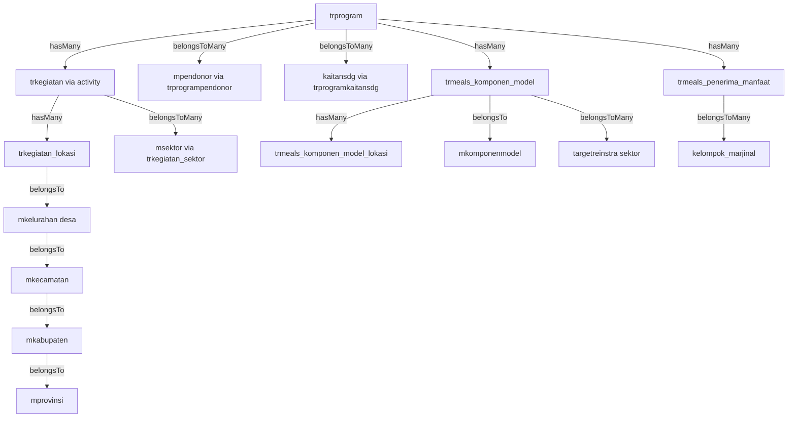

# Dashboard Revision Implementation Plan

## Overview

This plan provides comprehensive guidance for implementing three revised dashboards: **Beneficiaries Dashboard**, **Model Dashboard**, and **Pendanaan Dashboard**. Each dashboard requires specific database queries, controller logic, and Blade view implementations.

---

## Database Structure Analysis

### Key Tables and Relationships



### Critical Tables

1. **trprogram** - Main program table with status field
2. **trkegiatan** - Activities/transactions table
3. **trkegiatan_lokasi** - Location data with lat/long coordinates
4. **trmeals_penerima_manfaat** - Beneficiary data with gender
5. **trmeals_komponen_model** - Model components
6. **trmeals_komponen_model_lokasi** - Model locations with coordinates
7. **trprogrampendonor** - Program-donor relationship with donation amounts
8. **mkelurahan** - Village/desa data

---

## 1. Dashboard Beneficiaries (Main Dashboard)

### Requirements Summary

- Display per program/project per desa (not per province)
- Source data from `trkegiatan` → `trkegiatan_lokasi`
- Show program status (running, completed, etc.)
- Pie chart: Gender distribution
- Bar chart: Kelompok marjinal
- Use Figtree font

### Controller Implementation

See full controller code in the implementation plan document.

### Key Queries

**Get Kegiatan Locations (per desa):**

```sql
SELECT
    kl.lat, kl.long,
    k.tanggalmulai, k.tanggalselesai, k.penerimamanfaattotal,
    kel.nama as desa_nama,
    kec.nama as kecamatan_nama,
    p.nama as program_nama
FROM trkegiatan_lokasi kl
JOIN trkegiatan k ON kl.kegiatan_id = k.id
JOIN mkelurahan kel ON kl.desa_id = kel.id
WHERE kl.lat IS NOT NULL AND kl.long IS NOT NULL
```

---

## 2. Dashboard Model (Komodel Dashboard)

### Requirements Summary

- Title: "Model Dashboard"
- Pin points per province per location (with lat/long)
- Line chart: Trend per year
- Bar chart: Distribution by jenis model
- New chart: Kontribusi sektor terhadap komponen
- Add sektor filter

---

## 3. Dashboard Pendanaan (Pendonor Dashboard)

### Requirements Summary

- Title: "Pendanaan Dashboard"
- Chart 1: Kontribusi terhadap SDGs
- Chart 2: Kontribusi terhadap sektor (from transaksi program)
- Show total donation amounts in Rupiah format

---

## Implementation Notes

> [!IMPORTANT] > **Critical Points for Developers**
>
> 1. **Data Source for Beneficiaries**: Use `trkegiatan_lokasi` as the primary source for location markers
> 2. **Status Calculation**: Program status should be calculated dynamically based on dates
> 3. **Sektor Relationship**: Sektor data comes from `trkegiatan_sektor` table
> 4. **Model Locations**: Use `trmeals_komponen_model_lokasi` which has lat/long coordinates
> 5. **Donation Amounts**: Stored in `trprogrampendonor.nilaidonasi` field

---

## Next Steps

1. ✅ Review this implementation plan
2. Create controller files with the provided methods
3. Implement Blade views based on existing structure
4. Test each dashboard individually
5. Implement filter functionality
6. Perform user acceptance testing

**Full detailed implementation with complete controller code, SQL queries, and examples is available in the complete plan document.**
