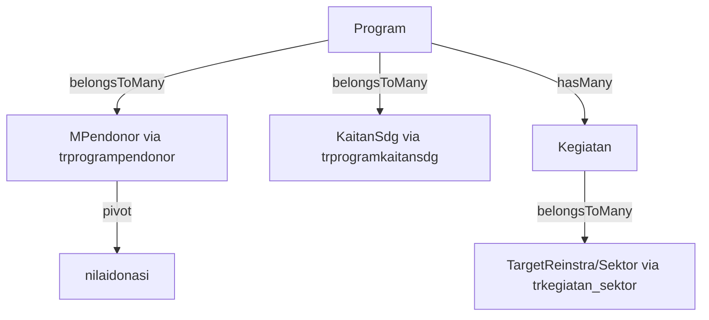

# Funding Dashboard Implementation Plan

## Overview

Implement the **Funding Dashboard (Pendanaan)** to visualize donation data, SDG contributions, and sector funding breakdown.

## Database Structure

### Key Relationships



### Critical Tables

1. **`mpendonor`** - Master donor list
2. **`trprogrampendonor`** - Program-Donor pivot with `nilaidonasi` field
3. **`mkaitansdg`** - SDG master data
4. **`trprogramkaitansdg`** - Program-SDG pivot
5. **`trkegiatan`** - Activities/transactions
6. **`trkegiatan_sektor`** - Activity-Sector pivot
7. **`mtargetreinstra/msektor`** - Sector master data

---

## Proposed Changes

### 1. Controller (`app/Http/Controllers/Revisi/Pendanaan.php`)

**New controller** to handle funding dashboard logic.

#### Methods:

**`index()`**

- Fetch filter data (Programs, Years, Donors)
- Return dashboard view

**`getData(Request $request)`**

- Process AJAX requests
- Apply filters (Program, Year, Donor)
- Return JSON with:
  - `stats`: Total funding, total donors, total programs
  - `sdgContribution`: Grouped by SDG with total funding
  - `sektorContribution`: Grouped by Sector with total funding
  - `donorList`: Donors with their contribution amounts

---

### 2. View (`resources/views/dashboard/revisi/pendanaan.blade.php`)

**New Blade view** matching AdminLTE style.

#### Components:

1. **Filter Section** - Program, Year, Donor dropdowns (Select2)
2. **Statistics Cards** (`small-box`) - Total Funding, Total Donors, Total Programs, Avg Donation
3. **SDG Contribution Chart** - Horizontal Bar Chart (Chart.js)
4. **Sector Contribution Chart** - Pie/Doughnut Chart (Chart.js)
5. **Donor List Table** - DataTables with donor name, total donated, formatted in Rupiah

---

## Detailed Query Logic

### Stats Calculation

```php
// Total Funding
$totalFunding = DB::table('trprogrampendonor')
    ->when($programId, fn($q) => $q->where('program_id', $programId))
    ->sum('nilaidonasi');

// Total Donors
$totalDonors = DB::table('trprogrampendonor')
    ->when($programId, fn($q) => $q->where('program_id', $programId))
    ->distinct('pendonor_id')
    ->count();

// Total Programs with Funding
$totalPrograms = DB::table('trprogrampendonor')
    ->distinct('program_id')
    ->count();
```

### SDG Contribution

```php
$sdgContribution = DB::table('trprogramkaitansdg as psdg')
    ->join('mkaitansdg as sdg', 'psdg.kaitansdg_id', '=', 'sdg.id')
    ->join('trprogrampendonor as pp', 'psdg.program_id', '=', 'pp.program_id')
    ->select('sdg.nama as sdg_name', DB::raw('SUM(pp.nilaidonasi) as total'))
    ->when($programId, fn($q) => $q->where('psdg.program_id', $programId))
    ->groupBy('sdg.id', 'sdg.nama')
    ->get();
```

### Sector Contribution

```php
$sektorContribution = DB::table('trkegiatan as k')
    ->join('trkegiatan_sektor as ks', 'k.id', '=', 'ks.kegiatan_id')
    ->join('mtargetreinstra as s', 'ks.sektor_id', '=', 's.id')
    ->join('trprogrampendonor as pp', 'k.program_id', '=', 'pp.program_id')
    ->select('s.nama as sektor_name', DB::raw('SUM(pp.nilaidonasi) as total'))
    ->when($programId, fn($q) => $q->where('k.program_id', $programId))
    ->groupBy('s.id', 's.nama')
    ->get();
```

### Donor List

```php
$donorList = MPendonor::withDonationCount()
    ->with('programs')
    ->get()
    ->map(fn($donor) => [
        'nama' => $donor->nama,
        'email' => $donor->email,
        'total_donated' => $donor->total_donation_value,
        'program_count' => $donor->programs->count()
    ]);
```

---

## Verification Plan

### Automated Tests

- Run `php artisan serve` and navigate to `/revisi/dashboard/pendanaan`
- Verify filter functionality (Program, Year)
- Check chart rendering
- Verify Rupiah formatting (e.g., `Rp 1.000.000`)

### Manual Verification

- Compare dashboard totals with database query results
- Verify SDG and Sector charts group data correctly
- Check donor list table sorting and searching

---

## Routes

Add to `routes/web.php`:

```php
Route::prefix('revisi/dashboard')->group(function() {
    Route::get('/pendanaan', [App\Http\Controllers\Revisi\Pendanaan::class, 'index'])
        ->name('revisi.dashboard.pendanaan');
    Route::get('/pendanaan/data', [App\Http\Controllers\Revisi\Pendanaan::class, 'getData'])
        ->name('revisi.dashboard.pendanaan.data');
});
```

---

## Notes

> [!IMPORTANT]
> Currency formatting uses Indonesian locale: `number_format($value, 0, ',', '.')` with "Rp" prefix.
> DataTables should include export buttons (Excel, PDF) if needed.
